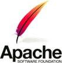
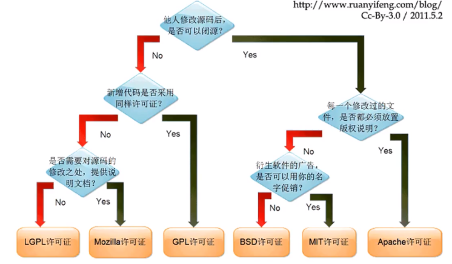
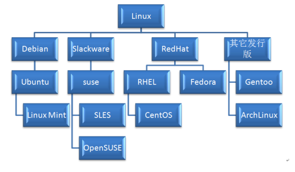
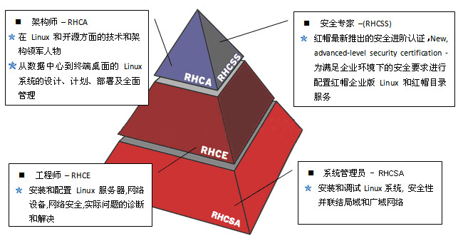

# Linux 操作系统简介

假设，我们现在就是在做一家外包公司，我们的目标是把这家公司做上市。

其中，操作系统就是这家外包公司的老板。我们把这家公司的发展阶段分为这样几个时期：

初创期：这个老板基于开放的营商环境，创办一家外包公司（系统的启动）。因为一开始没有其他员工，老板需要亲自接项目（实模式）。

发展期：公司慢慢做大，项目越接越多（保护模式、多进程），为了管理各个外包项目，建立了项目管理体系（进程管理）、会议室管理体系（内存管理）、文档资料管理系统（文件系统）、售前售后体系（输入输出设备管理）。

壮大期：公司越来越牛，开始促进内部项目的合作（进程间通信）和外部公司合作（网络通信）。

集团化：公司的业务越来越多，会成立多家子公司（虚拟化），或者鼓励内部创业（容器化），这个时候公司就变成了集团。大管家的调度能力不再局限于一家公司，而是集团公司（Linux 集群），从而成功上市（从单机操作系统到数据中心操作系统）。

# **开源与Linux系统发展史**

## 开源软件

把软件程序与源代码文件一起打包提供给用户，让用户在**不受限制地**使用某个软件功能的基础上还可以按需进行修改，或编制成衍生产品再发布出去。用户具有使用自由、修改自由、重新发布自由以及创建衍生品的自由。

## 开源软件特性

- 低风险：
- - 使用闭源软件无疑把命运交付给他人，一旦封闭的源代码没有人来维护，你将进退维谷；而且相较于商业软件公司，开源社区很少存在倒闭的问题。
- 高品质：
- - 相较于闭源软件产品，开源项目通常是由开源社区来研发及维护的，参与编写、维护、测试的用户量众多，一般的bug还没有等爆发就已经被修补。
- 低成本：
- - 开源工作者都是在幕后默默且无偿地付出劳动成果，为美好的世界贡献一份力量，因此使用开源社区推动的软件项目可以节省大量的人力、物力和财力。
- 更透明：
- - 没有哪个笨蛋会把木马、后门等放到开放的源代码中，这样无疑是把自己的罪行暴露在阳光之下。

## 常见开源协议

因此世界上现在有60多种被开源促进组织（Open Source Initiative）认可的开源许可协议来保证开源工作者的权益。

### GNU GPL（GNU General Public License，GNU通用公共许可证）

GNU is not Unix

只要软件中包含了遵循GPL协议的产品或代码，该软件就必须也遵循GPL许可协议且开源、免费，因此这个协议并不适合商用软件。遵循该协议的开源软件数量极其庞大，包括Linux系统在内的大多数的开源软件都是基于这个协议的。

- 复制自由
  - 允许把软件复制到任何人的电脑中，并且不限制复制的数量。
- 传播自由
  - 允许软件以各种形式进行传播。
- 收费传播
  - 允许在各种媒介上出售该软件，但必须提前让买家知道这个软件是可以免费获得的；因此，一般来讲，开源软件都是通过为用户提供有偿服务的形式来盈利的。
- 修改自由
  - 允许开发人员增加或删除软件的功能，但软件修改后必须依然基于GPL许可协议授权。

### BSD（Berkeley Software Distribution，伯克利软件发布版）许可协议

用户可以使用、修改和重新发布遵循该许可的软件，并且可以将软件作为商业软件发布和销售。

- 如果再发布的软件中包含源代码，则源代码必须继续遵循BSD许可协议。
- 如果再发布的软件中只有二进制程序，则需要在相关文档或版权文件中声明原始代码遵循了BSD协议。
- 不允许用原始软件的名字、作者名字或机构名称进行市场推广。

### Apache许可证版本（Apache License Version）许可协议

在为开发人员提供版权及专利许可的同时，允许用户拥有修改代码及再发布的自由。该许可协议适用于商业软件，现在热门的Hadoop、Apache HTTP Server、MongoDB等项目都是基于该许可协议研发的

- 该软件及其衍生品必须继续使用Apache许可协议。
- 如果修改了程序源代码，需要在文档中进行声明。
- 若软件是基于他人的源代码编写而成的，则需要保留原始代码的协议、商标、专利声明及其他原作者声明的内容信息。
- 如果再发布的软件中有声明文件，则需在此文件中标注Apache许可协议及其他许可协议。

### MPL（Mozilla Public License，Mozilla公共许可）许可协议

相较于GPL许可协议，MPL更加注重对开发者的源代码需求和收益之间的平衡。

### MIT（Massachusetts Institute of Technology）许可协议

目前限制最少的开源许可协议之一，只要程序的开发者在修改后的源代码中保留原作者的许可信息即可，因此普遍被商业软件所使用。

## Linux 发展史

20世纪70年代

- 开源免费的UNIX时代

1979年

- AT&T公司宣布了对UNIX系统的商业化计划

1984年

- Richard Stallman发起了GNU源代码开放计划并制定了著名的GPL许可协议

1987年

- GNU计划获得了一项重大突破—gcc编译器发布

1991年

- 芬兰赫尔辛基大学的在校生Linus Torvalds基于GUN GPL许可协议编写了一款名为Linux的操作系统

1994年

- Bob Young在Linux系统内核的基础之上，集成了众多的源代码和程序软件，发布了红帽系统并开始出售技术服务

1998年

- 以IBM和Intel为首的多家IT企业巨头开始大力推动开放源代码软件的发展

## Linux 图谱

[点开链接查看](https://github.com/FabioLolix/linuxtimeline)

# Linux 发行版

## Linux 名词

- Linux系统内核指的是一个由Linus Torvalds负责维护，提供硬件抽象层、硬盘及文件系统控制及多任务功能的系统核心程序。
- Linux发行套件系统是我们常说的Linux操作系统，也即是由Linux内核与各种常用软件的集合产品。

## RedHat 认证

### 